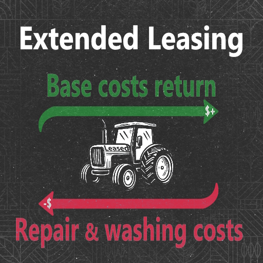
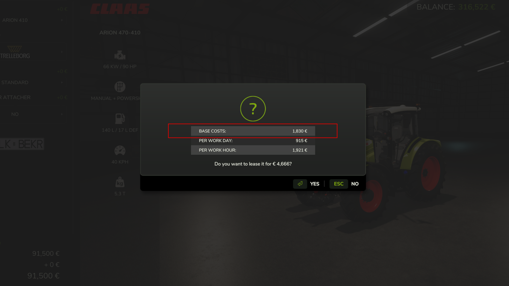
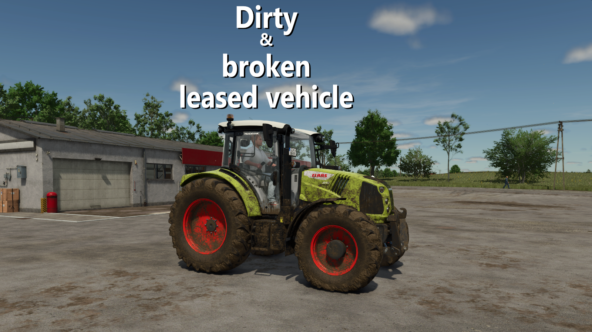
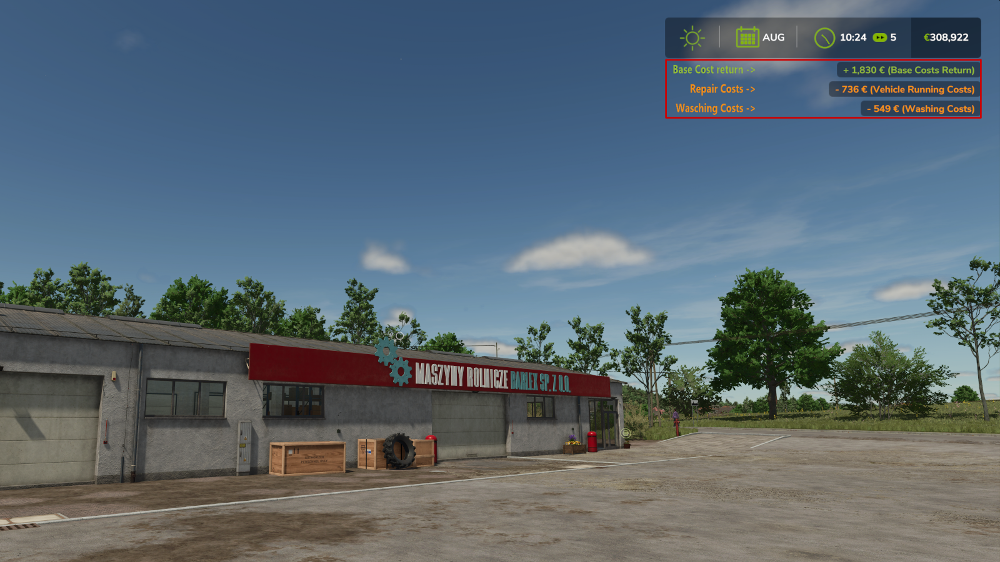

 

<h3 align="center"><u>FS25_ExtendedLeasing</u></h3>

    Stop with breaking down the dealer's tractors and equipment and not having to pay for it.
     
    With this mod you have to pay the repair costs when you return the tractor or equipment. Additionally you've to pay washing costs, max 30% of the basic costs (deposit), for a dirty tractor or equipment.
     
    For this you get back the base costs (deposit) that was paid at the beginning.

    
     
    
     
    

## Credits
* Sqeep

# Copyright
Copyright (c) 2024 [Dennis Schmitt](https://github.com/peppie84).
All rights reserved.

(<a href="#readme-top">back to top</a>)
